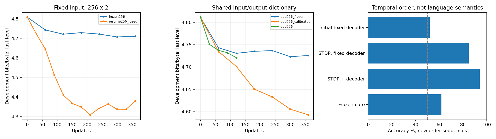

# Событийный STDP: измерения

Это отчёт об обучении спайковой сети. Полная семантическая работоспособность README не доказана.

## Чистое сравнение обучения внутренних связей

256×2, 8 микротактов и горизонтов, 4 канала задержки, batch=16, prompt/response=64/64, 360 обновлений. Входной код фиксирован; обычный Adam. Последняя точка, без выбора лучшего шага.

| Режим | Test h1, бит/байт | Среднее 8 горизонтов |
|---|---:|---:|
| Замороженные S/A | 4.655200 | 4.602603 |
| Событийный STDP S/A | 4.320859 | 4.550558 |
| Униграмма train | 4.664282 | 4.604467 |
| Биграмма, тот же бюджет ответов | 3.597465 | — |

Выигрыш последнего уровня: 0.334341; 95% paired bootstrap: [0.3104967793749206, 0.35749367499648993]. 256 документов.

Первый штатный выход ухудшился на 0.031674 бита. Это нельзя заменять утверждением, что все штатные выходы улучшились.

Независимые одинаковые линейные пробники (dev, 256 train/64 dev документов, whitening, ridge=.01):

| Уровень | Признаки до STDP | Признаки после STDP |
|---|---:|---:|
| 1 | 4.271639 | 4.214869 |
| 2 | 4.747128 | 4.339794 |

Сброс истории перед каждым байтом: 4.379347 → 5.586583 (dev).
Сброс только внутрислойных S/A: {'0': 4.383719198292, '1': 4.657230547283577}. Вклад внутренних связей первого уровня этим вмешательством отдельно убедительно не доказан.

Пробники поддерживают улучшение обоих представлений, но не доказывают насыщенную семантику. Генерация остаётся бессмысленной; примеры сохранены в language_final/summary.json.

## Временной порядок

| Режим | Точность первого / второго уровня |
|---|---:|
| order_frozen | 70.51% / 61.91% |
| order_resume | 94.53% / 94.14% |
| order_fixed_readout | 85.55% / 84.77% |
| initial_fixed_readout | 50.98% / 51.95% |

512 новых последовательностей помех, баланс классов и одинаковые наборы символов. Сброс памяти даёт 50%. У fixed_readout неизменны E, E_in, E_bias и пороги; учатся только S/A.

## Полный связанный режим

Первый input_credit=.1 давал входной STDP-сигнал примерно в 38 раз сильнее выходного CE-сигнала на общем E. Измерение использовало только train. Коэффициент .001 приводит их к сопоставимым масштабам; оба источника остаются активны. Это калибровка единиц двух правил, не вывод точного суммарного градиента.

На 192 заранее зарезервированных, ранее не оценивавшихся документах dev (не тот же тест, что таблица выше):

| Режим | h1 | Среднее 8 |
|---|---:|---:|
| frozen | 4.791628 | 4.735951 |
| trained | 4.675237 | 4.729384 |
| Униграмма | 4.783580 | 4.728480 |
| Биграмма | 3.721690 | — |

Paired gain: {'positive_means_recurrent_learning_helps': True, 'h1_gain_by_level': [0.07838301682208408, 0.11639082049864365], 'h1_gain_95pct_by_level': [[0.05742970278573852, 0.09686579090210247], [0.09512043013019851, 0.13480545322896925]], 'all_h_gain_by_level': [-0.023555955764003392, 0.006566133584044693], 'all_h_gain_95pct_by_level': [[-0.04697389711475195, -0.006955550722127553], [-0.0098962792770475, 0.01911332793655452]], 'n_documents': 192, 'bootstrap_samples': 4000}

## Цена и все попытки

| Попытка | N / H | Шагов | Dev h1, последний уровень | Медиана секунд/шаг | CUDA MiB, медиана пиков |
|---|---:|---:|---:|---:|---:|
| pilot_stdp | 64 / 8 | 60 | 4.7562 (шаг 60) | 0.349 | 30.2 |
| pilot_frozen | 64 / 8 | 60 | 4.7338 (шаг 60) | 0.229 | 14.5 |
| pilot_resume | 64 / 8 | 120 | 4.6160 (шаг 120) | 0.884 | 34.3 |
| pilot_h1 | 64 / 1 | 120 | 4.6465 (шаг 120) | 7.105 | не измерено |
| resume256 | 256 / 8 | 14 | 4.8078 (шаг 0) | 10.979 | 383.5 |
| resume256_fused | 256 / 8 | 360 | 4.3793 (шаг 360) | 2.466 | 272.0 |
| frozen256 | 256 / 8 | 360 | 4.7103 (шаг 360) | 0.313 | 57.2 |
| tied256 | 256 / 8 | 120 | 4.7208 (шаг 120) | 1.557 | 197.9 |
| tied256_calibrated | 256 / 8 | 360 | 4.5928 (шаг 360) | 1.552 | 198.4 |
| tied256_frozen | 256 / 8 | 360 | 4.7258 (шаг 360) | 0.654 | 62.2 |

pilot_h1 исполнялся на CPU; его скорость нельзя сравнивать с GPU-строками. resume256 остановлен ради точного объединения CUDA-операций, без вывода о качестве. В resume256_fused были два полных следа; текущая реализация хранит их точную разность одним тензором. costs.json содержит байтовый бюджет, состояние Adam и конфигурации.

## Границы вывода

Нет доказательства полного градиента CE через рекуррентную историю или убывания исходной Hopfield-энергии. Учитель языкового режима — исследовательская адаптация ReSuMe. S/A само по себе не даёт энергетической гарантии. Постоянные времени короткие и пока фиксированы. Сверхсходимость и связная семантическая генерация не получены.

Разделение данных исключает train/dev/test-пересечения внутри серии; корпус имеет историческое переиспользование. Отрицательные пилоты сохранены. JSONL, планы тестов и исходники каждого запуска — первичные свидетельства.

