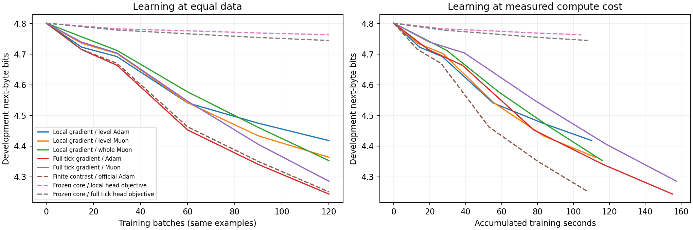

# Adam/Muon по уровням и через всю машину: проверка 2026-09-20

Архитектура допускает обычные оптимизаторы. Реализованы и проверены два
неконтрастных сигнала: точная частная производная локальной функции при
фиксированных соседних состояниях и точная производная через восемь
исполненных хопов текущего байта. По времени второй вариант дороже примерно
в 1.4 раза; память практически та же. Он обучает все уровни совместно,
но не дифференцирует историю предыдущих байтов.

Реализация и точные функции потерь: [документация](../../docs/OFFICIAL_OPTIMIZERS.md),
[код](../../drrem/core/energy_optimization.py). Исходный замысел — диалог README.

## Что фактически использовалось

Предыдущий основной checkpoint `predictive_energy_20260920/full/energy.pt`:
ручная реализация формулы Adam, проекция S/A, ограничитель относительного
шага; сигнал — разность частных производных двух коротких учительских фаз.
Старый `optimizer=muon` дополнительно применял собственные нормировки
`SignalRate` и восстанавливал норму сигнала; это не стандартный Muon.

Во всей новой таблице вызваны настоящие `torch.optim.Adam` / `torch.optim.Muon`.
Muon обновляет S/A, Adam — словарь, смещения, gate и параметры маршрутизации.
Остаются проекция на ограничения S/A и маски и clamp gate. Нет BB,
confidence, восстановления нормы или ограничителя относительного шага.
Прежний контрастный сигнал присутствует только в явно названной контрольной строке.

## Протокол

- Одна инициализация, seed=20260922; те же документы и их порядок во всех восьми вариантах.
- 256 нейронов × 2 уровня, 8 хопов, 8 горизонтов, batch=16, prompt/response до 64 байтов.
- По 120 обновлений и ровно 111063 обучающих байта ответа на вариант.
- Dev: 64 документа из заранее выделенных 256. Test: отдельные 256 документов.
- Train/dev/test ID и исходные ID, SHA корпуса, train-only unigram и source hashes сохранены
  в каждом `protocol.json`; пересечения и точные дубли между разделами отклоняются.
- Test открыт после фиксации всех восьми конечных checkpoints. Ни один вариант по test не подбирался.
  Фиксация: `comparison_plan.json`, `final_test_plan.json`, отдельные `test_plan.json`.
- Разделение защищает эту новую серию. Корпус уже использовался в исторических опытах;
  это не заявление о никогда прежде не виденных проектом документах.
- Adam core lr=0.0001; Muon core lr=0.0005 с `match_rms_adamw`, momentum=0.95,
  Nesterov, NS=5; общий head lr=0.003, router/gate lr=0.001, weight decay=0.
  На первом одинаковом локальном сигнале RMS обновления S: Adam 9.97e-5,
  Muon 8.27e-5. Это сравнимая начальная величина шага, не исчерпывающий подбор скоростей.
- Неконтрастные цели: CE каждого уровня + 0.1 × его остаточная энергия,
  плюс явная цена мягкого маршрута с lam_edge=0.05. Предыдущий контрастный
  контроль не содержит нового остаточного штрафа; сравнение этих строк меняет
  и сигнал, и эту часть цели. Точное отличие функций изложено в документации.
- Единственная GPU NVIDIA GB10, torch 2.11.0+cu130, параметры/градиенты float32;
  официальный Muon выполняет ортогонализацию в bfloat16.

## Результаты на test

Меньше bits/byte — лучше. h1 — следующий байт на последнем уровне;
среднее H — арифметическое среднее восьми горизонтов.
Время — медиана обучения батча после первых пяти шагов, без evaluation и записи.
Пик — максимум `torch.cuda.max_memory_allocated` после прогрева, включая модель,
градиенты, состояние и ленту; это не вся память процесса/CUDA-контекста.

| Вариант | Test h1 | Test среднее H | с/батч | байт/с | Пик МиБ | Состояние оптимизатора МиБ |
|---|---:|---:|---:|---:|---:|---:|
| Локальная производная, Adam по уровням | 4.3599 | 4.4615 | 0.896 | 1011 | 210.0 | 42.0 |
| Локальная производная, Muon по уровням | 4.3003 | 4.4058 | 0.946 | 986 | 192.0 | 24.0 |
| Локальная производная, Muon целых матриц | 4.3235 | 4.4087 | 0.966 | 947 | 192.0 | 24.0 |
| Градиент через 8 хопов, Adam | 4.1792 | 4.4148 | 1.291 | 724 | 210.5 | 42.0 |
| Градиент через 8 хопов, Muon | 4.2434 | 4.3802 | 1.297 | 707 | 192.5 | 24.0 |
| Прежний двухфазный сигнал, официальный Adam | 4.1898 | 4.4214 | 0.895 | 1035 | 201.8 | 42.0 |
| Замороженные связи, локальная цель словаря | 4.6242 | 4.5553 | 0.891 | 1061 | 116.2 | 4.0 |
| Замороженные связи, градиент через хопы для словаря | 4.6058 | 4.5389 | 0.899 | 1030 | 110.3 | 4.0 |

Глобальный Adam лучше по h1, глобальный Muon — по среднему восьми горизонтов.
Замена контраста на точную производную не дала огромного скачка сама по себе:
4.1898 → 4.1792 h1. Преимущество новой ветки — явная дифференцируемая задача
без конечной разности учительских фаз, при измеренной умеренной цене.

Это короткая проверка работоспособности и относительной стоимости, не потолки
семейств оптимизаторов и не доказательство выигрыша при любом seed/масштабе.



## Учится ли что-то кроме словаря

Униграмма, оценённая только по train: test h1 4.6437, среднее H 4.5828.

В контролях S/A, статический gate, параметры маршрутизации и theta побитово
сохранили инициализацию; общий словарь, включая связанный вход, обучался.
Проверки сохранены в `pretest_verification.json` и `posttest_verification.json`.

Глобальный Adam против соответствующего замороженного контроля:
первый уровень h1 4.4203 → 4.3352, второй 4.6058 → 4.1792.
Выигрыш второго уровня 0.4267 бита, парный 95% интервал по документам
[0.4067, 0.4474]. У локального Muon: первый 4.4044 → 4.3270,
второй 4.6242 → 4.3003; выигрыш второго [0.3006, 0.3499].

Это bootstrap по документам при фиксированных обученных весах; он не измеряет
разброс между инициализациями. Все парные сравнения, включая проигрыши,
сохранены в `summary.json`.

Дополнительная проверка на dev: возврат **внутренних** S/A только первого
уровня к инициализации ухудшает глобальный Adam с 4.2435 до 4.3169;
возврат только второго — до 4.2900. Остальные связи и словарь сохранялись.
Таким образом, оба внутренних блока функционально участвуют в результате.
Это lesion без переобучения, а не независимый линейный пробник информации.
Ненулевые градиенты каждого внутреннего блока и изменения весов также записаны.

## Действительно ли выгоднее отдельный оптимизатор уровня

Для Adam разделение при одинаковом шаге и счётчиках математически ничего не
меняет: каждый момент зависит только от градиента своей координаты.
Побитовый тест подтверждает равенство разделённого и общего Adam после трёх
обновлений, включая общие параметры и проекции. Состояние остаётся O(P).

У Muon разделение меняет матрицу ортогонализации и потому направление шага.
При одинаковом локальном сигнале test h1: по уровням 4.3003, целыми матрицами
4.3235; среднее H 4.4058 и 4.4087. Однако медиана **всего обновления с проекцией
и проверками** — 11.10 мс по уровням против 6.89 мс целыми матрицами.
На N=256 дополнительные вызовы ядер перевешивают уменьшение размеров матриц.
Время целого батча близко и чувствительно к состоянию устройства; универсальное
утверждение о большей скорости одного разбиения отсюда не следует.

Состояние оптимизатора: 42.03 МиБ у Adam, 24.03 МиБ у Muon+Adam.
Разбиение по уровням само по себе эти объёмы не уменьшает. Большая часть
времени уходит на последовательную релаксацию по байтам, а не на optimizer.step.

## Оставшиеся проблемы и допущения

1. **История отсечена между байтами.** Глобальность здесь относится ко всем
   уровням и хопам текущего байта. Это не полный градиент всей последовательности.
   Локальная цель дополнительно фиксирует соседние состояния; её точная частная
   производная не является точной производной конечного предсказания машины.
2. **Неполное соответствие README.** Сейчас и S, и A входят в энергию ошибки
   предсказания. Разделение «S задаёт энергию, A переносит по её уровням» не
   реализовано. Классическая pair-STDP, обучаемые задержки/фаза, адаптивный halt,
   событийный fanout и обычный BPE пока отсутствуют. Фиксированные временные
   каналы не заменяют эти механизмы.
3. **Цена маршрута не равна стоимости исполнения.** Вентили мягкие, матрицы
   плотные; закрытие ребра не исключает его из GEMM. Условный вентиль имеет
   ограниченный ранг 2. При L>2 хранятся и перемножаются полные D×D матрицы
   с маской вместо компактных соседних блоков: это лишняя квадратичная по L
   стоимость. На L=2 дальних запрещённых блоков ещё нет, поэтому нынешний
   опыт не проверяет масштабирование глубины.
4. **Нет доказанной языковой компетентности.** Свободная генерация после этих
   120 обновлений остаётся бессмысленной и почти одинаковой для разных вопросов.
   Проверялись только короткие префиксы ответов, одна инициализация и один корпус.
   Дополнительные хопы и уменьшение энергии не означают смыслового рассуждения.
5. **Ручные допущения остаются.** Коэффициенты энергии, скорости групп,
   нормировка общего словаря, бюджет 8 хопов и гомеостаз выбраны явно, а не
   выведены из универсального закона. Связанный вход с in_gain=8 в начальном
   состоянии сильно склоняет первый readout к текущему байту
   (`initial_copy_diagnostic.json`); это возможный конфликт якорения и прогноза.
   Backtracking дифференцируется по выбранной ветви; на границе её переключения
   функция не обязана быть гладкой.
   Пороги theta меняются отдельным гомеостатическим правилом, а не Adam/Muon;
   это ещё одна часть динамики обучения вне объявленного градиента по весам.

Голые STDP-статистики можно технически передать Adam/Muon, но от этого они не
становятся производными языковой задачи. В новой ветке временные каналы
обучаются производными объявленной функции. Это осознанная замена источника
сигнала, а не переименование STDP или контрастного правила.

## Проверки и воспроизведение

55/55 проверок: `tests.log`. Новые проверки: побитовое равенство Adam по
уровням и общего Adam; официальный Muon и проекции; продолжение Adam/Muon;
численная направленная производная через хопы, вход и router; сигнал каждого
уровня; убывание фиксированной локальной цели; отсутствие переноса учителя;
инвариантность градиентов к документам без целей; отсечение истории.

Запуск с новыми обычными оптимизаторами:

```bash
python -m scripts.compare_energy_optimizers --out reports/my_global_adam \
  --rule global --optimizer adam --scope global --core-lr .0001 --steps 120

python -m scripts.compare_energy_optimizers --out reports/my_local_muon \
  --rule local --optimizer muon --scope level --core-lr .0005 --steps 120
```

Для совпадения этой серии добавить `--dev-docs 64`; остальные параметры
записаны в `comparison_plan.json`. Тренер имеет отдельную оболочку checkpoint
с официальным состоянием оптимизаторов. Старый CLI `drrem.rrem_repaired`
сохраняет прежний двухфазный алгоритм для воспроизведения прежних результатов.
После final test продолжение обучения сохранённого запуска блокируется.

Исходники эксперимента, контрольные суммы, сырые JSONL и оценки отдельных
документов сохранены рядом. Для повторного использования модели достаточно
внутреннего `checkpoint['trainer']['machine']`; для продолжения обучения
нужен весь `EnergyTrainer` checkpoint, включая `optimizer_state`.

## Дополнительные хопы и энергия

| Вариант (dev) | 4 хопа | 8 хопов | 16 хопов | Мягко открытые рёбра |
|---|---:|---:|---:|---:|
| pilot_local_adam | 4.5005 | 4.4180 | 4.3815 | 0.834 |
| pilot_local_muon | 4.4421 | 4.3635 | 4.3435 | 0.841 |
| pilot_global_adam | 4.3268 | 4.2435 | 4.2281 | 0.838 |
| pilot_global_muon | 4.3671 | 4.2854 | 4.2684 | 0.843 |
| pilot_contrast_adam | 4.4020 | 4.2507 | 4.2240 | 0.835 |

В этой короткой серии 16 хопов улучшили h1 относительно 8 у всех проверенных вариантов, включая прежний контрастный контроль. Поэтому исторический провал 8→16 после 360 обновлений здесь не воспроизведён, но и его устранение именно новой производной не доказано. Долгое обучение этой ветки пока не проверено.

Например, у глобального Adam на одном сохранённом контексте средняя энергия уровней падает с [34.8044, 4.3207] до [0.0191, 0.0203]. Это внутренняя согласованность; бессмысленные неотобранные генерации в `diagnostics.json` показывают предел интерпретации этих чисел.
