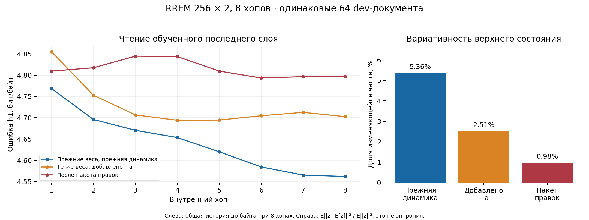

**Аудит обучаемости исправленной RREM, 19 сентября 2026**

Замысел взят из диалога [README](../../README.md). Исследована фактически запускаемая
[drrem/rrem_repaired.py](../../drrem/rrem_repaired.py), а не более ранняя одноимённая
копия из `rrem_review_20260919`. Работа выполнена без агентов.
Код машины зафиксирован в [source_snapshot.py](source_snapshot.py), хеши исходников
и использованных контрольных точек — в [source_manifest.json](source_manifest.json).
Производственная машина и чужие текущие прогоны не изменялись.

**Вывод: доказательства фундаментальной необучаемости нет. Есть конкретные разрывы
между замыслом, правилом обучения, динамикой и измерениями.** Самые существенные:
ошибка не обучает входные представления и внутренние связи первого слоя;
торможение несовместимо со знаковым содержанием; сопоставлялись разные места чтения;
генерация читает не обученный выход; запущенный «Muon» не включает Muon.

**1. Главная числовая предпосылка брифинга не выдерживает проверки.**

В исходных логах на шаге 250:

| Контрольная точка | h1 первого слоя | h1 последнего слоя | Среднее 8 горизонтов последнего слоя |
|---|---:|---:|---:|
| `lvlE_ro`, замороженная машина | 4,072242 | 4,844963 | 4,887517 |
| `last_clean`, обучение с чтением последнего слоя | 8,059314 | 4,562123 | 4,695271 |
| `fixed_all`, пакет последующих правок | 7,552166 | 4,796562 | 4,759380 |

Таким образом, «4,072 против 4,562» сравнивает первый слой, напрямую получающий
байт, со вторым слоем. Это не абляция рекуррентного обучения. Обратное сравнение
4,845 против 4,562 тоже нельзя выдавать за чистый выигрыш S/A: различаются привязка
входа, FF, гомеостаз и область обучения читалок. Для причинного вывода нужен запуск
с одинаковыми параметрами и единственным переключателем пластичности S/A.

Даже среднее восьми горизонтов первого слоя `lvlE_ro` равно 4,688977 — почти столько
же, сколько 4,695271 последнего слоя `last_clean`. В брифинге также смешивались
оценка h1 и задача оптимизации среднего по восьми горизонтам.

Исходные записи и конфигурации сохранены в [audit.json](audit.json), раздел
`provenance.runs`. У старых контрольных точек нет поля `readout_levels`; загрузка
текущим классом молча подставляет современное значение по умолчанию. Для истории
экспериментов приоритет имеют сохранённые послойные результаты, а не новый
заголовочный показатель после такой загрузки.

**2. Ошибка предсказания не доходит до значительной части вычисляющей машины.**

В `learn_tick`, строки 489–529 снимка, `signal` заполняется только для
`read_levels`. При `readout_levels='last'` и двух слоях сигнал первого слоя равен
нулю. Сообщения предыдущих хопов объявлены константами локального правила.
`_field_update` поэтому даёт строго нулевой CE-вклад во внутренний блок первого
слоя S/A. Симметризация передаёт обновления в обратный межслойный блок, но не
создаёт недостающий сигнал для внутренних связей первого слоя.

`_input_update` использует первые N координат `dI`; их CE-вклад тоже нулевой.
Кроме того, при `tie_input=True` входом служит `E[0,0]`, а обученным выходом —
`E[1,h]` (строки 275–306, 416–418). Это разные матрицы. В этой конфигурации
нет обещанного общего входного/выходного словаря. Входная таблица получает FF,
но не прямую задачу предсказания продолжения.

Измерение на реальных восьми dev-документах, на 17-м предсказываемом байте ответа,
после полного прогрева промптом; FF, награда и регуляризаторы исключены только
из измеряемого сигнала:

| Точка | Локальная норма CE для S первого слоя | Норма полного градиента этого блока | Локальная норма для входного E | Норма полного градиента входного E |
|---|---:|---:|---:|---:|
| Начальная машина | 0 | 0,009355 | 0 | 0,010091 |
| `last_clean`, текущая динамика | 0 | 0,030883 | 0 | 0,032267 |
| `fixed_all` | 0 | 0,014617 | 0 | 0,012332 |

Это проверка одного байтового такта с восемью внутренними хопами и фиксированной
предысторией. Здесь уже есть недостающий межнейронный путь — без обсуждения длинной
памяти. Повышение темпа или замена оптимизатора не исправляют нулевой сигнал.

Число `cos=1` относится к суррогату с замороженными сообщениями, а не ко всей
динамике одного байта. Для реальной динамики текущей `fixed_all` cosine по S
равен 0,993127, но относительная ошибка нормы и направления вместе — 19,6%.
Высокий общий cosine совместим с полным отсутствием сигнала для отдельных
функционально важных блоков. Полные результаты — `audit.json: real_credit`.

**3. Добавленное торможение меняет смысл знакового нейрона и измеримо вредит.**

Строка 399: `field = rec + I - st.a`, где `a` — неотрицательное среднее `abs(msg)`.
Содержание нейрона при этом знаковое: `tanh(u)`, а доступность коммуникации зависит
от `abs(u)`. Вычитание положительного a уменьшает положительное u, но увеличивает
модуль отрицательного u. Получается возбуждение отрицательной активности.

Алгебраическая проверка с одинаковым адаптивным порогом: для `u=±0,5`, `a=0,5`
и удерживающего входа без рекуррентности модуль сообщения без вычитания равен
0,29427 для обоих знаков. С вычитанием он равен 0,13952 для положительного знака
и **0,44317** для отрицательного. Это не симметричное торможение.

Проведено причинное сравнение на всех 64 исходных dev-документах: одни веса
`last_clean`, одинаковый вход, одинаковые пороги, фазы, адаптация и перенос
состояния. Единственное различие — наличие `−a` в поле. Отмена вычитания выполнена
передачей `I+a`, поэтому влияние a на порог сохранено.

| Те же веса `last_clean` | h1 | Доля вариативной части верхнего сообщения |
|---|---:|---:|
| Без нового вычитания a | 4,562122697 | 5,363% |
| С вычитанием a | 4,702613629 | 2,511% |

Первое значение воспроизводит исторический лог 4,562122723 с погрешностью
2,6·10⁻⁸. На `fixed_all` текущая оценка 4,796562357 также воспроизводит её лог.
Следовательно, старую контрольную точку нельзя оценивать новой динамикой и
считать изменение результата эффектом обученных весов.

Доля вариативной части определена как
`mean(||z−mean(z)||²) / mean(||z||²)`, по байтам и документам. У `fixed_all` она
равна 0,977%. Это наблюдение о преобладании постоянной компоненты, **не оценка
энтропии и не доказательство исчезновения 99% информации**. Небольшие отклонения
по-прежнему могут содержать полезные признаки. Варианты исправления: адаптация
доступности коммуникации через уже существующий порог либо торможение,
сохраняющее знак содержания; каждое следует проверять отдельно.

**4. Генерация, отрицательные примеры и график хопов читают другую голову.**

Основной итог `evaluate` выбирает последний читаемый слой. Но три других пути
жёстко используют `logits(..., 0)`:

- `hop_curve`, строка 712;
- распределение отрицательных байтов для FF, строка 738;
- `generate_bytes`, строка 771.

При обучении только верхнего словаря генерация использует нижнюю таблицу,
которая не училась как выход. FF берёт отрицательные примеры из той же
необученной головы. У `last_clean` исходный график заканчивается на 8,059 бита,
хотя реально обученный выход заканчивается на 4,562. Это ошибка измерения и
использования модели, отдельная от качества самого обучения.

Повторно измеренная h1 по хопам на правильном выходе:

| Конфигурация | Первый хоп | Восьмой хоп | Снижение |
|---|---:|---:|---:|
| `last_clean`, воспроизведённая прежняя динамика | 4,768420 | 4,562123 | 0,206297 |
| Те же веса, добавлено −a | 4,854857 | 4,702614 | 0,152243 |
| `fixed_all` | 4,809538 | 4,796562 | 0,012975 |

История предыдущих байтов во всех этих кривых прогрета при восьми хопах.
Это качество промежуточных состояний одного такта, а не отдельные полные запуски
с бюджетами 1…8. У улучшения по хопам может быть и обычная причина: верхнему слою
нужно время получить текущий байт. Само по себе оно ещё не доказывает рассуждение.



**5. Новый парный контроль уточняет вклад S/A.**

Для `fixed_all` возвращены только S и A к инициализации того же seed. Входные
таблицы, фазы, вентили, пороги и остальные настройки оставлены одинаковыми.
Затем на каждом представлении заново обучена одинаковая линейная читалка h1:
64 train-документа, 64 прежних dev-документа, ковариационная нормировка только
по train, одинаковый LBFGS и регуляризатор. Машина при этом заморожена.

| Верхние признаки | Исходная читалка | Новая читалка, ridge=0,01 | Новая читалка, ridge=0,1 |
|---|---:|---:|---:|
| Обученные S/A | 4,796562 | 4,565212 | 4,530629 |
| S/A возвращены к инициализации | 6,042436 | 4,606886 | 4,549736 |

Старая читалка сильно зависит от обученных весов; это ещё не означает, что
они содержат больше информации. После одинакового переобучения читалок
преимущество обученных S/A небольшое: 0,042 или 0,019 бита. Один набор из
64 документов не позволяет объявить такой разрыв устойчивым. Контроль
поддерживает гипотезу **слабого улучшения признаков**, но не тезис о безусловном
превосходстве случайной машины и не точный нулевой вклад пластичности.

Первоначальная проба с ridge=0,001 переобучилась: train около 1,5 бита против
dev около 6,3. Она сохранена в `dynamics.json`; для оценки потолка её использовать
нельзя. Более сильная регуляризация исследована после наблюдения переобучения,
результаты обоих значений приведены полностью в
[probe_regularization.json](probe_regularization.json). Это исследование на dev,
не новый независимый test и не доказанный потолок модели.

**6. Проверка оптимизаторов, цены и сохранения состояния.**

`optimizer='muon'` нигде не включает ортогонализацию. В `apply_batch` есть ветка
только для `optimizer=='adam'`, а ортогонализация включается отдельным
`cfg.muon`, по умолчанию `False` (строки 611–615). На одинаковых градиентах
обновления `optimizer='signal'` и `optimizer='muon'` побитово совпали.
`muon=True` действительно меняет направление. Поэтому имена текущих прогонов
`muon_only` и `energy_muon` не подтверждают испытания Muon.

На общем шаге 75 по логам: `muon_only` — 4,847468, `energy_muon` — 4,960778.
В обоих сохранено `optimizer='muon', muon=False`. В варианте с энергией средний
статический вентиль равен 0,9999886, минимальный — 0,9995121; ни один не ниже 0,99.
Выбора разреженных маршрутов здесь ещё не произошло. Последний снимок текущих
запусков на 23:49 UTC — [latest_runs.json](latest_runs.json); это промежуточные результаты,
а не обещание, что все процессы завершились.

`lam_edge` штрафует усреднённый квадрат потенциального синаптического тока,
а не число активных рёбер. Делитель для 256×2 — `M*mask.sum() = 2359296`.
Большой необходимый коэффициент частично объясняется этими единицами измерения.
Кроме того, динамические множители `gdyn` не входят в этот расчёт стоимости;
плата не совпадает с фактическим состояниезависимым маршрутом.

Награда при `reward_weight=0,5` умножает локальный сигнал на величину от 0,5 до 1,5.
Она не меняет знак, не выбирает ребро и не создаёт отсутствующий сигнал нижнего
слоя. При фиксированных восьми хопах и почти единичных вентилях увеличение
стоимости в основном регулирует амплитуду, а не выбор вычислительного пути.

Энергия `level_energy` использует сумму S по всем временным каналам как
одномоментный потенциал `msgᵀ S msg`. Настоящее поле использует разные задержанные
сообщения и следы, адаптацию и фазу. Поэтому объявленная энергия не порождает
реализованную динамику. Добавленный Hebb-член не устраняет это расхождение.
Он также не содержит gate из прямой производной объявленного потенциала и
усредняется по каналам иначе, чем сама `level_energy`; это отдельная эвристика,
а не показанный полный градиент заявленной функции CE+энергия+цена.

`checkpoint()` сохраняет `rates`, но не `adam` и не `bb`. После возобновления
Adam теряет моменты. Численная проверка: при одинаковом следующем градиенте
максимальное расхождение S между продолженным и восстановленным запуском равно
0,033282 в малом алгебраическом тесте. Упомянутое полное восстановление состояния справедливо не для всех
добавленных оптимизаторов.

Дополнительное расхождение конфигурации данных: обычный CLI принимает
`--prompt-max`, но не передаёт его в `DataConfig`. Поэтому при встроенном загрузчике
действует его значение по умолчанию, 512 байтов, а не заявленные CLI 256.

**7. Другие эксперименты не закрывают вопрос присвоения заслуг.**

Скрипт [старого сравнения BPTT](prior_instruments/tbptt.py.txt) использует 128×2,
четыре хопа и обучение только h1, хотя `H_pred=2`. В основной машине — 256×2,
восемь хопов и восемь обучаемых горизонтов. Его перенос состояния не обновляет
a/ref и не маскирует неактивные документы. `k=1` делает шаг Adam каждый байт,
`k=8` — каждые восемь байтов, с тем же lr; хвост неполного окна не применяется.
Следовательно, 4,395 против 4,412 не изолирует длину временного кредита и не
обосновывает отказ от всех методов его передачи.

`carry_elig=True` переносит только пассивный след с множителем `(1−alpha)` на
хоп. При восьми хопах и alpha=0,5 за байт сохраняется 1/256 прежнего следа;
его собственная постоянная времени — 0,1803 байта. В нём нет производных
медленной постсинаптической адаптации и рефрактерности. Медленные пресинаптические
каналы остаются, но это не делает такой перенос полной реализацией e-prop.
Для `gate_state>0` возникает ещё ошибка даже в локальном суррогате: множитель
получателя меняется по хопам, а код выносит текущий множитель за накопленную
историю eligibility. В алгебраическом тесте относительная ошибка S — 0,00454
при восьми хопах, против порядка 10⁻¹⁶ без динамического вентиля.

В статье [e-prop](https://www.nature.com/articles/s41467-020-17236-y) как раз
разделены eligibility и обучающий сигнал; отдельно разобран провал варианта,
когда скрытые слои отделяют рекуррентные нейроны от чтения. Это не аргумент
против локальной пластичности вообще: нужно обеспечить соответствующие
нейронам сигналы ошибки и следы собственных медленных состояний.

**8. «Нетронутый test» частично пересекается с прежним dev.**

Основной CLI выбирал dev через `heldout_batches(2,32,seed=2)` из всего пула.
[Позднейший тестовый скрипт](prior_instruments/test_eval.py.txt) заново перемешал
тот же пул и объявил вторую половину test. От этого уже использованные документы
не становятся новыми. В реально оценённых 128 test-документах пять уже входили
в прежние 64 dev-документа: локальные ID 667, 11919, 22571, 40111, 52021.
Их `source_row` и доказательство пересечения сохранены в `audit.json`.

Это пересечение с подбором, а не обнаруженное пересечение с обучающим потоком.
Оно не доказывает, что число 4,472 сильно смещено, но исключает формулировку
«документы, которых не видел никто и по которым ничего не подбиралось».
В этом аудите этот test заново не использовался для подбора или оценки.

**9. Нетривиальные направления, которые соответствуют замыслу README.**

Ниже — исследовательские гипотезы, не уже доказанные улучшения этой машины.
Их следует проверять раздельно на одинаковой динамике, одном выходном словаре
и закреплённых документах; основное сравнение — свободный проход после обучения.

| Направление | Что именно исправляет | Критерий полезного результата |
|---|---|---|
| Обучающий обратный сигнал к каждому слою, один общий выход | Нулевой CE-кредит нижним нейронам | Нижний блок и входной код учатся; на одинаково переобученной верхней читалке признаки лучше случайных |
| Парные возмущения нейронов и отложенная оценка их последствий | Потерю межнейронного пути без BPTT | Направления уменьшают реальную ошибку свободной траектории при приемлемой дисперсии |
| Несколько конкурирующих факторов вентиля | Ограниченный выбор рёбер и почти постоянные g | Контекст действительно меняет используемые связи, а оплаченные события покупают снижение ошибки |
| Согласованные энергия, торможение и транспорт | Усиление отрицательной активности и фиктивную энергетическую интерпретацию | Торможение уменьшает коммуникацию обоих знаков; объявленная энергия предсказывает наблюдаемую динамику |

Для первого направления интересен [Strong-DFC](https://arxiv.org/abs/2204.07249):
обучение уменьшает необходимое управляющее воздействие обратной связи. Это
естественнее соответствует желаемым возвратным маршрутам, чем добавление
словаря к каждому слою. Но опубликованная теория и результаты автоматически
не переносятся на эту конечную рекуррентную динамику с задержками; сначала нужен
контроль реального уменьшения ошибки после локального шага.

Для второго можно сравнивать две траектории из одного состояния с
противоположными малыми возмущениями нижних нейронов. Разность последующих потерь
даёт сигнал о причинном влиянии, который текущий локальный CE пропускает.
[Node Perturbation](https://arxiv.org/abs/2310.00965) исследует направленные
производные и декорреляцию входов как способы улучшить такое обучение. Для RREM
остаётся проверить стоимость и дисперсию. Утверждение «межнейронный кредит
неустраним, значит локальные методы бесполезны» из имеющихся опытов не следует;
[UORO](https://arxiv.org/abs/1702.05043) — ещё один подход с иной ценой и шумом.

Для третьего не обязателен материализованный тензор `(B,D,D)`. Например,

`g_ij = (1/R) * sum_r q_ri q_rj`, где `0 <= q_ri <= 1`,

даёт симметричный вентиль ранга до R, а ток вычисляется как

`sum_r q_r * ((x*q_r) @ W.T) / R`.

Это R матричных умножений, дополнительная память факторов O(BRD), а не O(BD²).
При R=2 получаем уже не одно общее перемасштабирование строк и столбцов.
Численная проверка dense против такого вычисления дала максимум расхождения
4,44·10⁻¹⁶, ранг вентиля действительно 2. Вычисления пока плотные O(RBD²):
экономия памяти не доказывает экономию синаптических событий. Даже ранг 1 при
зависящих от состояния множителях может создавать нелинейные взаимодействия;
близкие значения одного mixed-input теста не доказывают невозможность конъюнкций.

Наконец, в самом README есть математическая оговорка: антисимметричность A
не гарантирует, что `Az` движется вдоль произвольного энергетического рельефа.
Для `E(z)=zᵀ diag(1,2) z / 2`, `z=(1,1)` и поворотной A произведение
`grad(E)·Az = 1`, а не 0. Транспорт вида `A grad(E)` имеет нулевой вклад
`grad(E)ᵀ A grad(E)`. Это возможная конструктивная развилка для согласованной
энергетической модели, а не требование загонять всякое вычисление в равновесие.

**Воспроизведение и границы проверки.**

Основные численные измерения выполнялись на CPU, PyTorch 2.11.0, два потока, без
изменения исходных контрольных точек. Данные — существующий OpenOrca parquet.
Документы, конфигурации, нормы и метрики сохранены в JSON. Алгебраические
случайные тензоры использованы только для проверок производных и эквивалентности,
не как искусственный обучающий корпус. Новых длительных обучающих прогонов нет.

Из корня репозитория, с Python, в котором установлены torch, pyarrow и matplotlib:

```bash
RREM_RUNS='/tmp/claude-1000/-home-echoens/652a372e-fab8-4cb7-ba9d-eb5caff6dba8/scratchpad/rep'
python scripts/audit_repaired.py --source reports/repaired_audit_20260919/source_snapshot.py --runs "$RREM_RUNS" --out reports/repaired_audit_20260919
python scripts/probe_repaired_dynamics.py --source reports/repaired_audit_20260919/source_snapshot.py --runs "$RREM_RUNS" --out reports/repaired_audit_20260919
python scripts/probe_repaired_dynamics.py --source reports/repaired_audit_20260919/source_snapshot.py --runs "$RREM_RUNS" --out reports/repaired_audit_20260919 --refit-ridges 0.01 0.1
python scripts/plot_repaired_audit.py --out reports/repaired_audit_20260919
```

Кэши признаков остаются локально и исключены из Git. При смене кода, данных
или настроек нужно использовать новый каталог вывода: повторный запуск пробы
читает существующие кэши. Значение 3,70 из брифинга независимо не подтверждалось.
Новые цифры — диагностика на dev, не заявление о достигнутом качестве языка,
долгой памяти, семантическом рассуждении или обобщении на независимый test.
